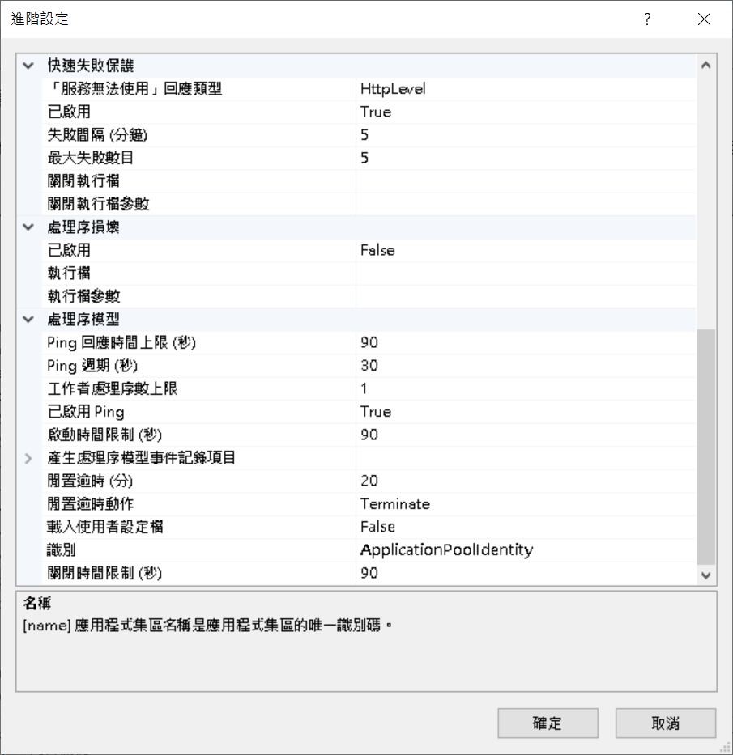

# 升級ASP.NET Core 3.1至5.0

1.將\*.csproj檔案的目標框架版本改為net5.0

```text
<Project Sdk="Microsoft.NET.Sdk.Web">

  <PropertyGroup>
-    <TargetFramework>netcoreapp3.1</TargetFramework>
+    <TargetFramework>net5.0</TargetFramework>
  </PropertyGroup>

</Project>
```

2.至Visual Studio選單之工具\(Tools\)-&gt;NuGet 套件管理員\(Package Manager\)-&gt;管理方案之NuGet套件\(Manage NuGet Packages for Solution\)

切換至 _**更新\(Updates\)**_頁籤，勾選套件並點選 _**更新**_ \(Update\)按鈕



[https://docs.microsoft.com/zh-tw/aspnet/core/migration/31-to-50?view=aspnetcore-5.0&tabs=visual-studio\#update-net-core-sdk-version-in-globaljson](https://docs.microsoft.com/zh-tw/aspnet/core/migration/31-to-50?view=aspnetcore-5.0&tabs=visual-studio#update-net-core-sdk-version-in-globaljson)

[https://docs.microsoft.com/zh-tw/dotnet/core/compatibility/3.1-5.0](https://docs.microsoft.com/zh-tw/dotnet/core/compatibility/3.1-5.0)

