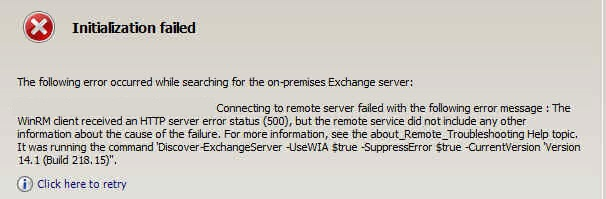

# Exchange Server 2010 Management Console 出現WinRM client錯誤

當裝有Exchange Server 2010的伺服器進行Windows Server版本升級或更新之後，開啟Exchange Management Console可能會遇到以下狀況：

_Connecting to remote server failed with the following error message : The WinRM client received an HTTP server error status (500), but the remote service did not include any other information about the cause fothe failure. _

_It was running the command 'Discover-ExchangeServer -UseWIA $true -SuppressError $true -CurrentVersion 'Version 14.X (Build XXX.X)''._

這代表WinRM IIS Extension（擴充套件）在升級Windows時被解除安裝了，需要到伺服器管理員->新增角色與功能將它裝回去～

.png>).png>).png>).png>).png>).png>)
