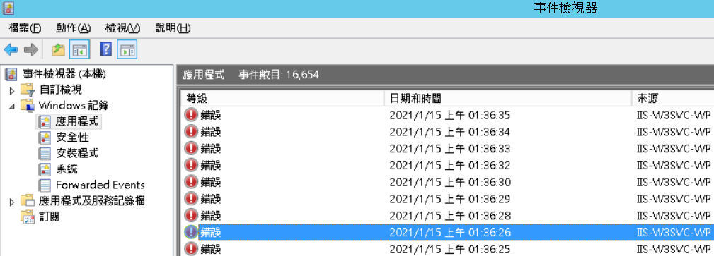
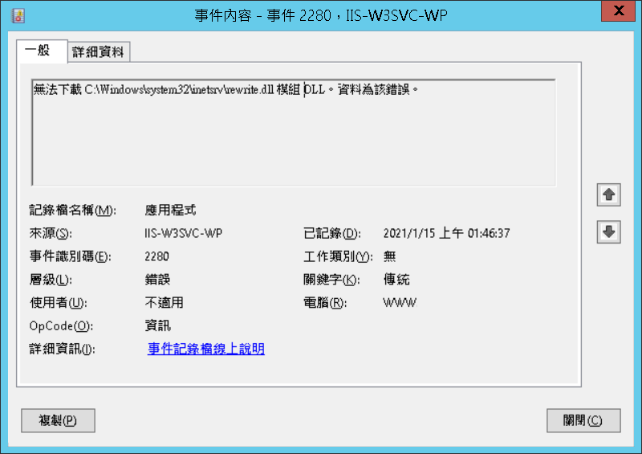

# 升級Windows Server 版本後瀏覽網站特定路徑出現 HTTP Error 503


當舊的 ASP.NET 網站（IIS應用程式集區）「啟用 32 位元應用程式」被設定成True時，在Server 2008 R2可以正常運作，但升級成Server 2012 R2，會造成集區執行後發生錯誤。

且到事件檢視器/Windows紀錄/應用程式內會發現IIS回報許多錯誤





若舊應用程式沒有使用到其他「非32位元不可」之模組的話，可以試著讓它在64位元環境跑跑看


若網站非得使用其他32位元元件，且沒有使用IIS URL Rewrite 之類的 Module，可以將他們停用

1\. **以系統管理員身分**開啟C:\Windows\System32\inetsrv\config\applicationHost.config 檔案

3\. 將以下字串

```markup
<add name="RewriteModule" image="%SystemRoot%\system32\inetsrv\rewrite.dll" />
```

改為

```markup
<add name="RewriteModule" image="%SystemRoot%\system32\inetsrv\rewrite.dll" preCondition="bitness64" />
```

並存檔，如此此模組只會在64位元應用程式執行

