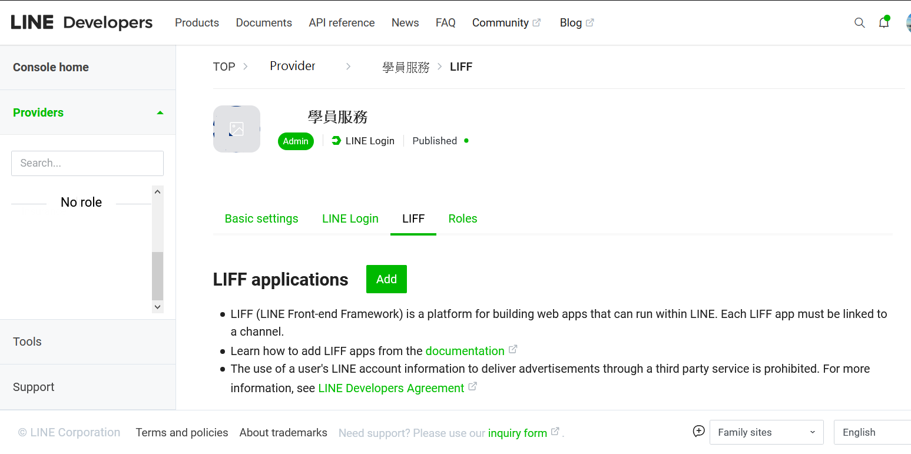

# Line LIFF 設定方式

LIFF 全稱為 LINE Front-end Framework ，顧名思義就是前端的框架~

使用它最大的好處在於開發者可以取得LINE 平台的各種使用者資料，像是 LINE user ID、暱稱、大頭貼等...

LINE 管理LIFF App 的目的是為了在「方便」和「保護」個資取得平衡XD

2019/11 以前LIFF App是新增在 Messageing API Channel 內，但從那時開始，LIFF 為了配合LINE整併Channel 功能的政策，而逐步轉移至LINE Login Channel 內，讓登入、授權、個資存取功能合併。

## 1.至Line Login Channel 新增 LIFF應用程式

## ２. 填寫App基本資料

包括

2.1.應用名稱\(LIFF app name\)：讓開發者辨識連結目標之名稱

2.2.尺寸\(Size\)：在LINE 應用程式開啟LIFF連結後，畫面應佔據螢幕版面的的比例，有滿版\(Full\)、高\(Tall\)、緊湊\(Compact\) 三種版面。

2.3.端點\(Endpoint URL\)：開啟欲使用LIFF SDK網站之網址

2.4.範圍\(Scopes\)：要取用的個資項目，有個人檔案\(profile\)和開放ID\(openid\) 兩種

2.5.機器人連結功能\(Bot link feature\)：可以允許LIFF 開發者提示使用者加入相同Provider 底下特定的官方帳號

2.6.掃描二維碼\(Scan QR code\)：當開發者要在LIFF App 內使用QR code 讀取功能時須開啟

[https://developers.line.biz/en/docs/liff/overview/](https://developers.line.biz/en/docs/liff/overview/)

