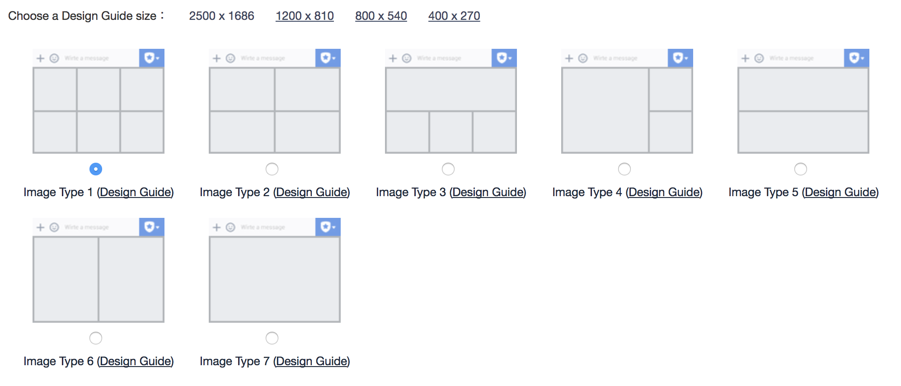

# Line與WeChat格式轉換

  
**一、    Line與WeChat訊息格式比較**

**1.     選單格式**

LINE圖文選單 \[1\]

步驟一：登入LINE@電腦版後台

步驟二：建立圖文影音內容 &gt; 圖文選單 &gt; 建立新頁面

接著選擇【以圖片製作】樣板，直接上傳一張圖片，並選擇想要呈現的圖文選單格式，可切分為1~6格的版本（注意：欲上傳的圖片必須在事先設計時，就畫好邊框，符合欲呈現的格式，再直接上傳整張圖）

按照畫面上的指示，依據選擇的樣板，填寫點選選單區塊要觸發的動作\(action\)及內容，這次的專案設定6個區塊在點選後都回覆「文字」。

圖 一：Line 7種不同分割法的圖文選單

WeChat自定義菜單 \[2\]

1、自定義菜單最多包括3個一級菜單，每個一級菜單最多包含5個二級菜單。

2、一級菜單最多4個漢字，二級菜單最多7個漢字，多出來的部分將會以“...”代替。

3、創建自定義菜單後，菜單的刷新策略是，在用戶進入公眾號會話頁或公眾號profile頁時，如果發現上一次拉取菜單的請求在5分鐘以前，就會拉取一下菜單，如果菜單有更新，就會刷新客戶端的菜單。測試時可以嘗試取消關注公眾賬號後再次關注，則可以看到創建後的效果。

**由於WeChat選單的限制，Line圖文選單的區塊數如果是6的話，需拆成2個一級菜單。且選單只能以文字的形式呈現，回送webhook** **只能以click事件方式觸發（不像在Line點選圖文選單，使用者會看到自己送出文字）。**

自定義菜單接口click事件：

點擊推事件用戶點擊click類型按鈕後，微信服務器會通過消息接口推送消息類型為event的結搆給開發者（參考消息接口指南），並且帶上按鈕中開發者填寫的key值，開發者可以通過自定義的key值與用戶進行交互

{

    "button": \[

        {

            "name": "加入公勝",

            "sub\_button": \[

                {

                    "type": "click",

                    "name": "公司資訊",

                    "key": "introduction"

                },

                {

                    "type": "click",

                    "name": "保險公司",

                    "key": "company"

                },

                {

                    "type": "click",

                    "name": "主力商品",

                    "key": "product"

                }

            \]

        },

        {

            "name": "幸福滿分",

            "sub\_button": \[

                {

                    "type": "click",

                    "name": "個人績效",

                    "key": "performance"

                },

                {

                    "type": "click",

                    "name": "公勝行政",

                    "key": "administrative"

                },

                {

                    "type": "click",

                    "name": "培訓競賽",

                    "key": "training"

                }

            \]

        }

    \]

}

**2.  文字訊息**

**Line Text message \[3\]**

**{**

    **"type": "text",**

    **"text": "Hello, world"**

**}**

表 一：Line文字訊息物件\(Message object\)之格式，參數只包含類型與文字

<table>
  <thead>
    <tr>
      <th style="text-align:left"><b>Property</b>
      </th>
      <th style="text-align:left"><b>Type</b>
      </th>
      <th style="text-align:left"><b>Required</b>
      </th>
      <th style="text-align:left"><b>Description</b>
      </th>
    </tr>
  </thead>
  <tbody>
    <tr>
      <td style="text-align:left">type</td>
      <td style="text-align:left">String</td>
      <td style="text-align:left">Required</td>
      <td style="text-align:left">text</td>
    </tr>
    <tr>
      <td style="text-align:left">text</td>
      <td style="text-align:left">String</td>
      <td style="text-align:left">Required</td>
      <td style="text-align:left">
        
Message text. You can include the following emoji:

        <ul>
          <li>Unicode emoji</li>
          <li>LINE original emoji (<a href="https://developers.line.me/media/messaging-api/emoji-list.pdf">Unicode codepoint table for LINE original emoji</a>)</li>
        </ul>
        
Max: 2000 characters

      </td>
    </tr>
  </tbody>
</table>**WeChat發送文本消息 \[4\]**

{

    "touser":"OPENID",

    "msgtype":"text",

    "text":

    {

         "content":"Hello, World"

    }

}

表 二：WeChat文本消息之格式，由於WeChat將接收方的ID設計成訊息JSON物件的一部分，所以參數多了touser

| **參數** | **是否必須** | **描述** |
| :--- | :--- | :--- |
| ToUser | 是 | 接收方帳號（收到的OpenID） |
| MsgType | 是 | text |
| Content | 是 | 回復的消息內容（換行：在content中能夠換行，微信客戶端就支持換行顯示） |

**3.  影像地圖訊息**

**Line Imagemap message**

Imagemap 訊息範例 with tappable regions

{

    "type": "imagemap",

    "baseUrl": "https://storage.googleapis.com/goldeninsurancebroker-4392f.appspot.com/imageMap/training\_0629",

    "altText": "培訓競賽",

    "baseSize": {

        "width": 1040,

        "height": 530

    },

    "actions": \[

        {

            "type": "uri",

            "area": {

                "x": 0,

                "y": 201,

                "width": 335,

                "height": 410

            },

            "linkUri": \`${config.uriName}\#/trainingCases/{lineId}\`

        },

        {

            "type": "uri",

            "area": {

                "x": 335,

                "y": 192,

                "width": 345,

                "height": 419

            },

            "linkUri": \`${config.uriName}\#/achievements/{lineId}\`

        },

        {

            "type": "uri",

            "area": {

                "x": 680,

                "y": 189,

                "width": 356,

                "height": 422

            },

            "linkUri": hostName + "/broker\_system/views/lineLogin/personal.html?page=course"

        }

    \]

}

表 三：Line 影像地圖訊息格式，可以看到imagemap 動作物件是以物件陣列形式表現

| **Property** | **Type** | **Required** | **Description** |
| :--- | :--- | :--- | :--- |
| type | String | Required | imagemap |
| baseUrl | String | Required | [Base URL](https://developers.line.me/en/reference/messaging-api/#base-url) of image \(Max: 1000 characters\)  **HTTPS** |
| altText | String | Required | Alternative text  Max: 400 characters |
| baseSize.width | Number | Required | Width of base image \(set to 1040px\) |
| baseSize.height | Number | Required | Height of base image \(set to the height that corresponds to a width of 1040px\) |
| actions | Array of [imagemap action objects](https://developers.line.me/en/reference/messaging-api/#imagemap-action-objects) | Required | Action when tapped  Max: 50 |

**Line Imagemap URI action object**

表 四：承上 actions，imagemap action object

| **Property** | **Type** | **Required** | **Description** |
| :--- | :--- | :--- | :--- |
| type | String | Required | uri |
| label | String | Optional | Label for the action. Spoken when the accessibility feature is enabled on the client device.  Max: 50 characters  Supported on LINE iOS version 8.2.0 and later. |
| linkUri | String | Required | Webpage URL  Max: 1000 characters |
| area | [Imagemap area object](https://developers.line.me/en/reference/messaging-api/#imagemap-area-object) | Required | Defined tappable area |

**WeChat圖文消息（點擊跳轉到外鏈）**

圖文消息條數限制在8條以內，注意，如果圖文數超過8，則將會無響應。

{

    "touser":"OPENID",

    "msgtype":"news",

    "news":{

        "articles": \[

         {

             "title":"課程教案",

             "description":"培訓競賽",

             "url":\`${config.uriName}\#/trainingCases/{lineId}\`,

             "picurl":"圖示網址"

         },

         {

             "title":"競賽獎勵",

             "description":"培訓競賽",

             "url":\`${config.uriName}\#/achievements/{lineId}\`,

             "picurl":"圖示網址"

         },

         {

             "title":"報名專區",

             "description":"培訓競賽",

             "url": hostName + "/broker\_system/views/lineLogin/personal.html?page=course",

             "picurl":"圖示網址"

         }

         \]

    }

}

**Line的ImageMap action object的數量要在8條以內，且每一個連結都需要另外填寫文字與製作圖示，才能直接轉成單一WeChat圖文消息。否則需要改以多則圖文消息或網頁的形式呈現訊息。**

表 五： WeChat圖文訊息格式

| 參數 | 是否必須 | 說明 |
| :--- | :--- | :--- |
| ToUserName | 是 | 接收方帳號（收到的OpenID） |
| MsgType | 是 | news |
| ArticleCount | 是 | 圖文消息個數，限制為8條以內 |
| Articles | 是 | 多條圖文消息信息，默認第一個item為大圖,注意，如果圖文數超過8，則將會無響應 |
| Title | 是 | 圖文消息標題 |
| Description | 是 | 圖文消息描述 |
| PicUrl | 是 | 圖片鏈接，支持JPG、PNG格式，較好的效果為大圖360\*200，小圖200\*200 |
| Url | 是 | 點擊圖文消息跳轉鏈接 |

**4.  按鈕樣板訊息**

**Line Buttons template**

{

                    type: "template",

                    altText: \`${companyName}資訊查詢\`,

                    template: {

                        type: "buttons",

                        title: \`公勝iSmart智能秘書\`,

                        text: \`${companyName}繳費資訊\`,

                        actions: \[

                            {

                                type: "uri",

                                label: "查看資訊",

                                uri: \`${config.uriName}\#/paymentInfo/${actionMessage.lineId}/${index}\`

                            }

                        \]

                    }

                }

Template with an image, title, text, and multiple action buttons.

表 六：按鈕樣板訊息格式

| **Property** | **Type** | **Required** | **Description** |
| :--- | :--- | :--- | :--- |
| type | String | Required | `buttons` |
| thumbnailImageUrl | String | Optional | Image URL \(Max: 1000 characters\)  **HTTPS**  JPEG or PNG  Max width: 1024px  Max: 1 MB |
| title | String | Optional | Title  Max: 40 characters |
| text | String | Required | Message text  Max: 160 characters \(no image or title\)  Max: 60 characters \(message with an image or title\) |
| actions | Array of [action objects](https://developers.line.me/en/reference/messaging-api/#action-objects) | Required | Action when tapped  Max: 4 |

WeChat發送圖文消息（點擊跳轉到外鏈） 圖文消息條數限制在8條以內，注意，如果圖文數超過8，則將會無響應。

{

    "touser":"OPENID",

    "msgtype":"news",

    "news":{

        "articles": \[

         {

             "title":\`同Confirm template之 actions的第一個label\`,

             "description": "同Confirm template的text",

             "url":\`${config.uriName}\#/paymentInfo/${actionMessage.lineId}/${index}\`,

             "picurl":"圖示網址"

         }

         \]

    }

}

**轉換成WeChat圖文消息只須要另外提供圖示即可。**

**5.  「確認」樣板訊息**

**Confirm template**

{

  "type": "template",

  "altText": "同Confirm template 的text ",

  "template": {

      "type": "confirm",

      "text": "遠雄人壽\_人身保險要保書",

      "actions": \[

          {

            "type": "uri",

            "label": "檢視",

            "uri": "文件網址"

          },

          {

             "type": "uri",

            "label": "轉傳",

            "uri": \`${config.uriName}\#/forward/${lineId}/${fileId}/${type}\`

          }

      \]

  }

}

Template with two action buttons.

表 七

| **Property** | **Type** | **Required** | **Description** |  |  |
| :--- | :--- | :--- | :--- | :--- | :--- |
| type | String | Required | `confirm` |  |  |
| text | String | Required | Message text  Max: 240 characters |  |  |
| actions | Array of [action objects](https://developers.line.me/en/reference/messaging-api/#action-objects) | Required | Action when tapped  Set 2 actions for the 2 buttons |  |  |
|  |  |  |  |  |  |

WeChat發送圖文消息（點擊跳轉到外鏈） 圖文消息條數限制在8條以內，注意，如果圖文數超過8，則將會無響應。

{

    "touser":"OPENID",

    "msgtype":"news",

    "news":{

        "articles": \[

         {

             "title":"同Confirm template 的text \n同Confirm template之 actions的第一個label ",

             "description":" 同Confirm template 的text",

             "url":"同Confirm template之 actions的第一個uri 文件網址 ",

             "picurl":"圖示網址"

         },

         {

             "title":"同Confirm template之 actions的第二個label ",

             "description":"同 Confirm template 的text",

             "url":\`${config.uriName}\#/forward/${lineId}/${fileId}/${type}\`,

             "picurl":"圖示網址"

         }

         \]

    }

}

**轉換成WeChat圖文消息須要另外提供圖示，且news articles之第一個title要包含Confirm template 的text，以避免當description沒有顯示時，使用者較難分辨該圖文消息的用途。**

當WeChat圖文消息只有一條時，news articles之title與description的關係

當WeChat圖文消息有兩條（含）以上時，只有news articles之title會顯示出來

