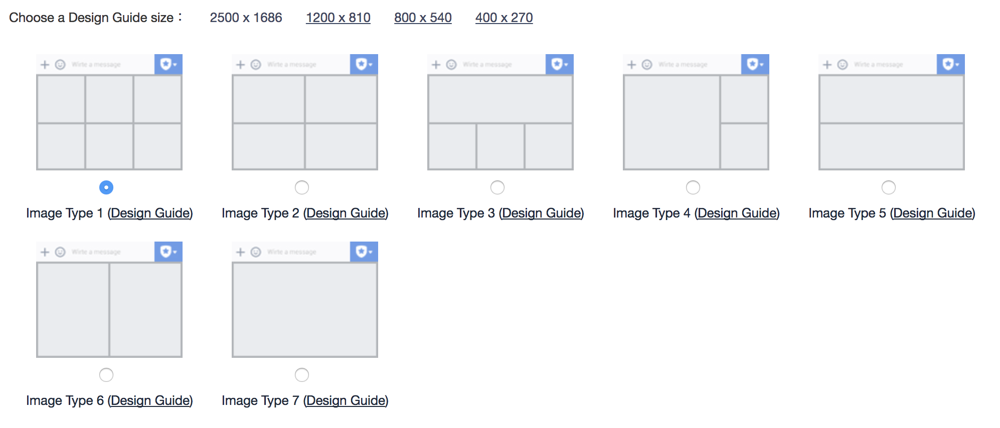

# Line與WeChat格式轉換

\
**一、    Line與WeChat訊息格式比較**

**1.     選單格式**

LINE圖文選單 \[1]

步驟一：登入LINE@電腦版後台

步驟二：建立圖文影音內容 > 圖文選單 > 建立新頁面

接著選擇【以圖片製作】樣板，直接上傳一張圖片，並選擇想要呈現的圖文選單格式，可切分為1\~6格的版本（注意：欲上傳的圖片必須在事先設計時，就畫好邊框，符合欲呈現的格式，再直接上傳整張圖）

按照畫面上的指示，依據選擇的樣板，填寫點選選單區塊要觸發的動作(action)及內容，這次的專案設定6個區塊在點選後都回覆「文字」。

圖 一：Line 7種不同分割法的圖文選單

WeChat自定義菜單 \[2]

1、自定義菜單最多包括3個一級菜單，每個一級菜單最多包含5個二級菜單。

2、一級菜單最多4個漢字，二級菜單最多7個漢字，多出來的部分將會以“...”代替。

3、創建自定義菜單後，菜單的刷新策略是，在用戶進入公眾號會話頁或公眾號profile頁時，如果發現上一次拉取菜單的請求在5分鐘以前，就會拉取一下菜單，如果菜單有更新，就會刷新客戶端的菜單。測試時可以嘗試取消關注公眾賬號後再次關注，則可以看到創建後的效果。

**由於WeChat選單的限制，Line圖文選單的區塊數如果是6的話，需拆成2個一級菜單。且選單只能以文字的形式呈現，回送webhook** **只能以click事件方式觸發（不像在Line點選圖文選單，使用者會看到自己送出文字）。**

自定義菜單接口click事件：

點擊推事件用戶點擊click類型按鈕後，微信服務器會通過消息接口推送消息類型為event的結搆給開發者（參考消息接口指南），並且帶上按鈕中開發者填寫的key值，開發者可以通過自定義的key值與用戶進行交互

{

&#x20;   "button": \[

&#x20;       {

&#x20;           "name": "加入公勝",

&#x20;           "sub\_button": \[

&#x20;               {

&#x20;                   "type": "click",

&#x20;                   "name": "公司資訊",

&#x20;                   "key": "introduction"

&#x20;               },

&#x20;               {

&#x20;                   "type": "click",

&#x20;                   "name": "保險公司",

&#x20;                   "key": "company"

&#x20;               },

&#x20;               {

&#x20;                   "type": "click",

&#x20;                   "name": "主力商品",

&#x20;                   "key": "product"

&#x20;               }

&#x20;           ]

&#x20;       },

&#x20;       {

&#x20;           "name": "幸福滿分",

&#x20;           "sub\_button": \[

&#x20;               {

&#x20;                   "type": "click",

&#x20;                   "name": "個人績效",

&#x20;                   "key": "performance"

&#x20;               },

&#x20;               {

&#x20;                   "type": "click",

&#x20;                   "name": "公勝行政",

&#x20;                   "key": "administrative"

&#x20;               },

&#x20;               {

&#x20;                   "type": "click",

&#x20;                   "name": "培訓競賽",

&#x20;                   "key": "training"

&#x20;               }

&#x20;           ]

&#x20;       }

&#x20;   ]

}

**2.  文字訊息**

**Line Text message \[3]**

**{**

**    "type": "text",**

**    "text": "Hello, world"**

**}**

表 一：Line文字訊息物件(Message object)之格式，參數只包含類型與文字

| **Property** | **Type** | **Required** | **Description**                                                                                                                                                                                                                                                               |
| ------------ | -------- | ------------ | ----------------------------------------------------------------------------------------------------------------------------------------------------------------------------------------------------------------------------------------------------------------------------- |
| type         | String   | Required     | text                                                                                                                                                                                                                                                                          |
| text         | String   | Required     | 
Message text. You can include the following emoji:
<ul><li>Unicode emoji</li><li>LINE original emoji (<a href="https://developers.line.me/media/messaging-api/emoji-list.pdf">Unicode codepoint table for LINE original emoji</a>)</li></ul>
Max: 2000 characters
 |

**WeChat發送文本消息 \[4]**

{

&#x20;   "touser":"OPENID",

&#x20;   "msgtype":"text",

&#x20;   "text":

&#x20;   {

&#x20;        "content":"Hello, World"

&#x20;   }

}

表 二：WeChat文本消息之格式，由於WeChat將接收方的ID設計成訊息JSON物件的一部分，所以參數多了touser

| **參數**  | **是否必須** | **描述**                                 |
| ------- | -------- | -------------------------------------- |
| ToUser  | 是        | 接收方帳號（收到的OpenID）                       |
| MsgType | 是        | text                                   |
| Content | 是        | 回復的消息內容（換行：在content中能夠換行，微信客戶端就支持換行顯示） |

**3.  影像地圖訊息**

**Line Imagemap message**

Imagemap 訊息範例 with tappable regions

{

&#x20;   "type": "imagemap",

&#x20;   "baseUrl": "https://storage.googleapis.com/goldeninsurancebroker-4392f.appspot.com/imageMap/training\_0629",

&#x20;   "altText": "培訓競賽",

&#x20;   "baseSize": {

&#x20;       "width": 1040,

&#x20;       "height": 530

&#x20;   },

&#x20;   "actions": \[

&#x20;       {

&#x20;           "type": "uri",

&#x20;           "area": {

&#x20;               "x": 0,

&#x20;               "y": 201,

&#x20;               "width": 335,

&#x20;               "height": 410

&#x20;           },

&#x20;           "linkUri": \`${config.uriName}#/trainingCases/{lineId}\`

&#x20;       },

&#x20;       {

&#x20;           "type": "uri",

&#x20;           "area": {

&#x20;               "x": 335,

&#x20;               "y": 192,

&#x20;               "width": 345,

&#x20;               "height": 419

&#x20;           },

&#x20;           "linkUri": \`${config.uriName}#/achievements/{lineId}\`

&#x20;       },

&#x20;       {

&#x20;           "type": "uri",

&#x20;           "area": {

&#x20;               "x": 680,

&#x20;               "y": 189,

&#x20;               "width": 356,

&#x20;               "height": 422

&#x20;           },

&#x20;           "linkUri": hostName + "/broker\_system/views/lineLogin/personal.html?page=course"

&#x20;       }

&#x20;   ]

}

表 三：Line 影像地圖訊息格式，可以看到imagemap 動作物件是以物件陣列形式表現

| **Property**    | **Type**                                                                                                           | **Required** | **Description**                                                                                                                                          |
| --------------- | ------------------------------------------------------------------------------------------------------------------ | ------------ | -------------------------------------------------------------------------------------------------------------------------------------------------------- |
| type            | String                                                                                                             | Required     | imagemap                                                                                                                                                 |
| baseUrl         | String                                                                                                             | Required     | 
<a href="https://developers.line.me/en/reference/messaging-api/#base-url">Base URL</a> of image (Max: 1000 characters)  <strong>HTTPS</strong>
 |
| altText         | String                                                                                                             | Required     | 
Alternative text  Max: 400 characters
                                                                                                          |
| baseSize.width  | Number                                                                                                             | Required     | Width of base image (set to 1040px)                                                                                                                      |
| baseSize.height | Number                                                                                                             | Required     | Height of base image (set to the height that corresponds to a width of 1040px)                                                                           |
| actions         | Array of [imagemap action objects](https://developers.line.me/en/reference/messaging-api/#imagemap-action-objects) | Required     | 
Action when tapped  Max: 50
                                                                                                                    |

**Line Imagemap URI action object**

表 四：承上 actions，imagemap action object

| **Property** | **Type**                                                                                            | **Required** | **Description**                                                                                                                                                               |
| ------------ | --------------------------------------------------------------------------------------------------- | ------------ | ----------------------------------------------------------------------------------------------------------------------------------------------------------------------------- |
| type         | String                                                                                              | Required     | uri                                                                                                                                                                           |
| label        | String                                                                                              | Optional     | 
Label for the action. Spoken when the accessibility feature is enabled on the client device.  Max: 50 characters  Supported on LINE iOS version 8.2.0 and later.
 |
| linkUri      | String                                                                                              | Required     | 
Webpage URL  Max: 1000 characters
                                                                                                                                   |
| area         | [Imagemap area object](https://developers.line.me/en/reference/messaging-api/#imagemap-area-object) | Required     | Defined tappable area                                                                                                                                                         |

**WeChat圖文消息（點擊跳轉到外鏈）**

圖文消息條數限制在8條以內，注意，如果圖文數超過8，則將會無響應。

{

&#x20;   "touser":"OPENID",

&#x20;   "msgtype":"news",

&#x20;   "news":{

&#x20;       "articles": \[

&#x20;        {

&#x20;            "title":"課程教案",

&#x20;            "description":"培訓競賽",

&#x20;            "url":\`${config.uriName}#/trainingCases/{lineId}\`,

&#x20;            "picurl":"圖示網址"

&#x20;        },

&#x20;        {

&#x20;            "title":"競賽獎勵",

&#x20;            "description":"培訓競賽",

&#x20;            "url":\`${config.uriName}#/achievements/{lineId}\`,

&#x20;            "picurl":"圖示網址"

&#x20;        },

&#x20;        {

&#x20;            "title":"報名專區",

&#x20;            "description":"培訓競賽",

&#x20;            "url": hostName + "/broker\_system/views/lineLogin/personal.html?page=course",

&#x20;            "picurl":"圖示網址"

&#x20;        }

&#x20;        ]

&#x20;   }

}

**Line的ImageMap action object的數量要在8條以內，且每一個連結都需要另外填寫文字與製作圖示，才能直接轉成單一WeChat圖文消息。否則需要改以多則圖文消息或網頁的形式呈現訊息。**

表 五： WeChat圖文訊息格式

| 參數           | 是否必須 | 說明                                           |
| ------------ | ---- | -------------------------------------------- |
| ToUserName   | 是    | 接收方帳號（收到的OpenID）                             |
| MsgType      | 是    | news                                         |
| ArticleCount | 是    | 圖文消息個數，限制為8條以內                               |
| Articles     | 是    | 多條圖文消息信息，默認第一個item為大圖,注意，如果圖文數超過8，則將會無響應     |
| Title        | 是    | 圖文消息標題                                       |
| Description  | 是    | 圖文消息描述                                       |
| PicUrl       | 是    | 圖片鏈接，支持JPG、PNG格式，較好的效果為大圖360\*200，小圖200\*200 |
| Url          | 是    | 點擊圖文消息跳轉鏈接                                   |

**4.  按鈕樣板訊息**

**Line Buttons template**

{

&#x20;                   type: "template",

&#x20;                   altText: \`${companyName}資訊查詢\`,

&#x20;                   template: {

&#x20;                       type: "buttons",

&#x20;                       title: \`公勝iSmart智能秘書\`,

&#x20;                       text: \`${companyName}繳費資訊\`,

&#x20;                       actions: \[

&#x20;                           {

&#x20;                               type: "uri",

&#x20;                               label: "查看資訊",

&#x20;                               uri: \`${config.uriName}#/paymentInfo/${actionMessage.lineId}/${index}\`

&#x20;                           }

&#x20;                       ]

&#x20;                   }

&#x20;               }

Template with an image, title, text, and multiple action buttons.

表 六：按鈕樣板訊息格式

| **Property**      | **Type**                                                                                         | **Required** | **Description**                                                                                                         |
| ----------------- | ------------------------------------------------------------------------------------------------ | ------------ | ----------------------------------------------------------------------------------------------------------------------- |
| type              | String                                                                                           | Required     | `buttons`                                                                                                               |
| thumbnailImageUrl | String                                                                                           | Optional     | 
Image URL (Max: 1000 characters)  <strong>HTTPS</strong>  JPEG or PNG  Max width: 1024px  Max: 1 MB
  |
| title             | String                                                                                           | Optional     | 
Title  Max: 40 characters
                                                                                     |
| text              | String                                                                                           | Required     | 
Message text  Max: 160 characters (no image or title)  Max: 60 characters (message with an image or title)
 |
| actions           | Array of [action objects](https://developers.line.me/en/reference/messaging-api/#action-objects) | Required     | 
Action when tapped  Max: 4
                                                                                    |

WeChat發送圖文消息（點擊跳轉到外鏈） 圖文消息條數限制在8條以內，注意，如果圖文數超過8，則將會無響應。

{

&#x20;   "touser":"OPENID",

&#x20;   "msgtype":"news",

&#x20;   "news":{

&#x20;       "articles": \[

&#x20;        {

&#x20;            "title":\`同Confirm template之 actions的第一個label\`,

&#x20;            "description": "同Confirm template的text",

&#x20;            "url":\`${config.uriName}#/paymentInfo/${actionMessage.lineId}/${index}\`,

&#x20;            "picurl":"圖示網址"

&#x20;        }

&#x20;        ]

&#x20;   }

}

**轉換成WeChat圖文消息只須要另外提供圖示即可。**

**5.  「確認」樣板訊息**

**Confirm template**

{

&#x20; "type": "template",

&#x20; "altText": "同Confirm template 的text ",

&#x20; "template": {

&#x20;     "type": "confirm",

&#x20;     "text": "遠雄人壽\_人身保險要保書",

&#x20;     "actions": \[

&#x20;         {

&#x20;           "type": "uri",

&#x20;           "label": "檢視",

&#x20;           "uri": "文件網址"

&#x20;         },

&#x20;         {

&#x20;            "type": "uri",

&#x20;           "label": "轉傳",

&#x20;           "uri": \`${config.uriName}#/forward/${lineId}/${fileId}/${type}\`

&#x20;         }

&#x20;     ]

&#x20; }

}

Template with two action buttons.

表 七

| **Property** | **Type**                                                                                         | **Required** | **Description**                                               |   |   |
| ------------ | ------------------------------------------------------------------------------------------------ | ------------ | ------------------------------------------------------------- | - | - |
| type         | String                                                                                           | Required     | `confirm`                                                     |   |   |
| text         | String                                                                                           | Required     | 
Message text  Max: 240 characters
                   |   |   |
| actions      | Array of [action objects](https://developers.line.me/en/reference/messaging-api/#action-objects) | Required     | 
Action when tapped  Set 2 actions for the 2 buttons
 |   |   |
|              |                                                                                                  |              |                                                               |   |   |

WeChat發送圖文消息（點擊跳轉到外鏈） 圖文消息條數限制在8條以內，注意，如果圖文數超過8，則將會無響應。

{

&#x20;   "touser":"OPENID",

&#x20;   "msgtype":"news",

&#x20;   "news":{

&#x20;       "articles": \[

&#x20;        {

&#x20;            "title":"同Confirm template 的text \n同Confirm template之 actions的第一個label ",

&#x20;            "description":" 同Confirm template 的text",

&#x20;            "url":"同Confirm template之 actions的第一個uri 文件網址 ",

&#x20;            "picurl":"圖示網址"

&#x20;        },

&#x20;        {

&#x20;            "title":"同Confirm template之 actions的第二個label ",

&#x20;            "description":"同 Confirm template 的text",

&#x20;            "url":\`${config.uriName}#/forward/${lineId}/${fileId}/${type}\`,

&#x20;            "picurl":"圖示網址"

&#x20;        }

&#x20;        ]

&#x20;   }

}

**轉換成WeChat圖文消息須要另外提供圖示，且news articles之第一個title要包含Confirm template 的text，以避免當description沒有顯示時，使用者較難分辨該圖文消息的用途。**

當WeChat圖文消息只有一條時，news articles之title與description的關係

當WeChat圖文消息有兩條（含）以上時，只有news articles之title會顯示出來
