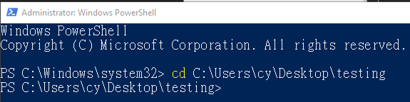

# Node.js TypeScript環境建置

Node.js是一個能夠在伺服端運行JavaScript的執行環境；而近年來Microsoft開發之TypeScript是JavaScript的超集，並含了非強制性的變數型別\(string、number、bool\)和類別\(Class\)，對於想把Web Service、API寫得稍微嚴謹的programmer來說真是個福音。

```text
在開始之前開始，首先至 https://nodejs.org/en/ 頁面選擇LTS版本下載及安裝Node.js。完成之後，就可以打開命令列介面視窗，切換路徑到想存放新專案的目錄底下。
```

 



對於現代的程式設計師來說，沒有甚麼事是比利用套件管理工具更重要的事了，NPM就是一套可以讓開發人員事半功倍的服務，只要輸入npm init，NPM會自動產生一個名為package.json的檔案，裡面記載各套件名稱與版本。

